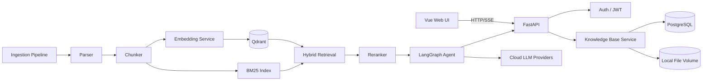

# 个人知识库 AgentRAG — 需求与设计文档

> 版本：v0.1（需求冻结草稿）
> 日期：2026-09-12
> 状态：待用户确认；未生成业务代码

## 1. 项目目标

构建一个个人知识库 AgentRAG 系统，支持多来源资料导入、多知识库管理、混合检索增强问答，并提供一个可逐步扩展的 Agent 工作流。第一版先满足个人本地使用，同时为后续服务器部署和多人使用预留结构。

## 2. 范围

### 2.1 MVP 第一版范围

- 多知识库/项目空间 + 文档集合管理。
- 文档/网页/笔记导入、解析、切分、向量入库。
- 混合检索：BM25 + 稠密向量 + 本地重排。
- 多轮问答、来源引用、原文跳转。
- 基础 Agent：用户下发任务后，Agent 调用“知识库检索 + 文档总结”工具完成多步任务。
- Web UI：知识库、文档、对话、检索调试、模型设置、Token 用量。
- 登录认证：管理员创建用户，默认内置管理员账号。
- 本地 Docker 运行环境，后续 Linux 服务器部署。

### 2.2 明确不在第一版

- 扫描 PDF/图片的 OCR。
- 完整 Git 仓库索引、AST 结构感知、函数级索引。
- 自动知识卡、实体关系、标签自动生成。
- 定时任务、主动推荐。
- 实时文件夹监听。
- 邮件/Webhook 告警。
- 公网域名、Nginx、HTTPS 的实际部署。

## 3. 用户角色

- 管理员：管理用户、模型配置、知识库、文档、系统设置。
- 普通用户：在授权范围内上传、检索、问答。
- 第一版默认仅内置一个管理员账号，不开放公开注册。

## 4. 技术选型

| 模块 | 选型 | 说明 |
| --- | --- | --- |
| 后端语言 | Python 3.13.15 | 依赖不兼容时退回 Python 3.12 |
| Web 框架 | FastAPI | 异步、主流 |
| 前端 | Vue 3 + Vite + TypeScript | 用户指定 |
| 前端状态/组件 | Pinia + Element Plus | 主流组合 |
| 向量数据库 | Qdrant | 本地 Docker 运行，后续服务器部署方便 |
| 元数据数据库 | PostgreSQL 16 | 用户、文件、知识库、任务、用量等；本地 Docker 运行 |
| 文件存储 | 本地卷 /data/files | 第一版使用文件系统，后续可迁移 MinIO |
| Embedding | BAAI/bge-m3，默认本地 | 支持量化；配置可切换，提供云端 embedding 开关 |
| Reranker | BAAI/bge-reranker-v2-m3 | 配置可切换，可退回 bge-reranker-base |
| 词法检索 | Python BM25 索引 | 第一版进程内索引，后续可迁移 Qdrant sparse vectors |
| Agent 编排 | LangGraph | 当前主流方案 |
| 对话模型 | 多 provider 可配置 | DeepSeek / Qwen / OpenAI / 智谱 / Ollama 兼容接口 |
| 部署 | Docker Desktop + WSL2 本地 | 后续 Ubuntu + Docker Compose + Nginx + HTTPS |
| OCR | 第二版引入 | 规划 MinerU / PaddleOCR + PP-StructureV3 |

## 5. 功能需求

### 5.1 认证与用户

- FR-AUTH-001：用户名 + 密码登录，使用 JWT。
- FR-AUTH-002：密码必须哈希存储，不落明文。
- FR-AUTH-003：管理员可创建/禁用用户；不开放注册。
- FR-AUTH-004：首次启动生成默认管理员账号，或通过环境变量指定。
- FR-AUTH-005：后端所有业务接口校验登录状态，前端路由守卫。

### 5.2 知识库管理

- FR-KB-001：支持创建、重命名、删除、切换知识库。
- FR-KB-002：每个知识库包含多个文档集合/项目空间。
- FR-KB-003：支持设置知识库级别的 embedding、rerank、BM25、云模型配置。
- FR-KB-004：删除知识库前需二次确认，并提示将删除其向量与文件索引。

### 5.3 数据导入与同步

- FR-INGEST-001：支持 Web UI 拖拽/选择上传文件。
- FR-INGEST-002：支持手动扫描本地指定目录，并点击“同步”触发。
- FR-INGEST-003：支持粘贴 URL 抓取网页内容。
- FR-INGEST-004：支持导入 Obsidian/笔记目录。
- FR-INGEST-005：支持 API 批量导入。
- FR-INGEST-006：导入任务异步执行，展示任务状态：等待、解析中、已完成、失败、已取消。
- FR-INGEST-007：失败任务保留错误日志，支持重试。

### 5.4 文件解析

第一版支持：

- PDF：提取已有文字层；无文字层时仅记录文件名/元数据，OCR 第二版。
- DOCX、PPTX、Markdown、TXT、HTML。
- CSV / XLSX：按表格语义解析为结构化文本。
- JSON / XML：按结构化文本解析，保留层级路径作为 metadata。
- 网页 URL：抓取正文，保留标题、URL、抓取时间。
- 图片/扫描 PDF：第一版仅索引已有文字层或文件名。
- 代码文件：第一版按普通文本/代码块切分入库。

### 5.5 切分与索引

- FR-CHUNK-001：根据文件类型选择切分策略，保留 chunk 的源文件、页/段落、层级路径等 metadata。
- FR-CHUNK-002：对代码块使用代码友好的分块，避免破坏函数上下文。
- FR-CHUNK-003：每个 chunk 生成向量并写入 Qdrant，同时保存 chunk 元数据到 PostgreSQL。
- FR-CHUNK-004：同一知识库内维护 BM25 索引。
- FR-CHUNK-005：支持文档重新解析、删除、更新索引。

### 5.6 混合检索

- FR-RETRIEVE-001：支持关键词 BM25 检索。
- FR-RETRIEVE-002：支持稠密向量检索。
- FR-RETRIEVE-003：使用 RRF 或加权方式融合 BM25 和向量结果。
- FR-RETRIEVE-004：使用本地 reranker 对候选 chunk 重排。
- FR-RETRIEVE-005：支持按知识库、文档、文件类型、metadata 过滤。
- FR-RETRIEVE-006：检索测试页展示候选 chunk、分数、重排结果和来源。

### 5.7 对话问答与 Agent

- FR-CHAT-001：支持多轮对话，保持上下文。
- FR-CHAT-002：回答必须附带来源引用，可点击跳转原文/原始文件位置。
- FR-CHAT-003：支持选择回答使用的知识库。
- FR-CHAT-004：支持流式输出，前端逐步展示。
- FR-AGENT-001：第一版 Agent 工具：`knowledge_base_search`、`summarize`。
- FR-AGENT-002：用户可下发多步任务，例如“检索并总结这些资料”。
- FR-AGENT-003：Agent 流程由 LangGraph 编排，状态可追踪。
- FR-AGENT-004：Agent 操作展示中间步骤，便于调试。

### 5.8 模型配置

- FR-MODEL-001：对话模型支持 provider 配置，如 DeepSeek、Qwen、OpenAI、智谱、Ollama/OpenAI 兼容接口。
- FR-MODEL-002：API Key、base_url、模型名、温度等通过配置管理。
- FR-MODEL-003：embedding 默认本地，但支持云端 embedding 开关。
- FR-MODEL-004：本地模型可配置模型名、量化方式、并发数。
- FR-MODEL-005：配置统一封装，方便后续增加 provider。

### 5.9 Token 用量与成本

- FR-USAGE-001：记录每次对话模型的 provider、模型名、输入/输出 token、耗时、时间。
- FR-USAGE-002：如果启用云端 embedding，记录 embedding token 或调用次数。
- FR-USAGE-003：本地 embedding/rerank 记录调用次数与耗时，不按 token 计费。
- FR-USAGE-004：提供每日/每月统计、按 provider/模型分类、费用估算。
- FR-USAGE-005：支持配置单价和阈值，超过阈值在 UI 内提醒。
- FR-USAGE-006：OCR 在第二版记录图片/PDF 页数与处理数量。

### 5.10 UI 页面

- 登录页。
- 主布局：左侧导航，顶部用户信息。
- 知识库管理页。
- 文档管理页。
- 对话问答页。
- 检索测试页。
- 系统设置页。
- Token 用量页。

## 6. 非功能需求

- 安全性：密码哈希、JWT、环境变量管理密钥、CORS 白名单、上传文件类型/大小限制。
- 性能：按 1000 文件、约 2GB 数据设计；异步导入；CPU-only 环境下可接受较慢但需可观察。
- 可扩展性：模型 provider、embedding、reranker、向量库均可配置替换。
- 可部署性：本地 Docker Compose，后续迁移 Linux 服务器。
- 可维护性：前后端分离，模块化，配置外置。
- 可观测性：日志、任务状态、检索调试、Token 用量。

## 7. 系统架构



## 8. 核心数据模型

- users：用户账号、角色、状态、创建时间。
- knowledge_bases：知识库名称、描述、配置、所有者。
- document_collections：知识库下的集合/项目空间。
- documents：文件名、类型、大小、路径、状态、来源、metadata。
- chunks：chunk 文本、chunk 序号、metadata、关联 document。
- ingestion_jobs：导入任务、状态、进度、错误信息。
- model_configs：provider、模型名、API Key 引用、参数、单价。
- usage_records：provider、模型、token、耗时、成本、类型、时间。
- retrieval_logs / agent_runs：可选，用于调试和审计。

## 9. API 概览

- /api/v1/auth：登录、刷新 token。
- /api/v1/users：管理员管理用户。
- /api/v1/knowledge-bases：知识库 CRUD。
- /api/v1/documents：文档列表、删除、重新解析。
- /api/v1/ingestion：上传、目录扫描、URL 抓取、任务状态。
- /api/v1/chat：对话问答、Agent 任务。
- /api/v1/retrieval：检索调试接口。
- /api/v1/settings/models：模型与 provider 配置。
- /api/v1/usage：Token 用量与成本统计。
- /health：健康检查。

## 10. 页面清单

| 页面 | 功能 |
| --- | --- |
| 登录页 | 账号密码登录 |
| 主布局 | 导航、用户菜单、退出登录 |
| 知识库管理 | 创建/切换/删除知识库，查看文档集合 |
| 文档管理 | 上传、目录扫描、URL 导入、任务状态、删除/重解析 |
| 对话问答 | 多轮对话、引用来源、Agent 中间步骤、流式输出 |
| 检索测试 | 输入 query，查看 BM25/向量/融合/重排结果 |
| 系统设置 | 模型 provider、API Key、embedding、rerank、OCR 开关占位 |
| Token 用量 | 日/月统计、模型分类、费用、阈值提醒 |

## 11. 建议目录结构

```text
one_RAG/
├─ docs/
│  └─ PRD.md
├─ backend/
│  ├─ app/
│  │  ├─ main.py
│  │  ├─ core/
│  │  │  ├─ config.py
│  │  │  └─ security.py
│  │  ├─ db/
│  │  │  ├─ base.py
│  │  │  ├─ session.py
│  │  │  └─ init_db.py
│  │  ├─ models/
│  │  ├─ schemas/
│  │  ├─ api/
│  │  │  └─ v1/
│  │  ├─ services/
│  │  ├─ rag/
│  │  │  ├─ parser/
│  │  │  ├─ splitter/
│  │  │  ├─ embeddings/
│  │  │  ├─ reranker/
│  │  │  ├─ bm25/
│  │  │  └─ retrieval/
│  │  ├─ agents/
│  │  ├─ tasks/
│  │  └─ utils/
│  ├─ tests/
│  ├─ pyproject.toml
│  └─ Dockerfile
├─ frontend/
│  ├─ src/
│  │  ├─ api/
│  │  ├─ components/
│  │  ├─ layouts/
│  │  ├─ router/
│  │  ├─ stores/
│  │  ├─ types/
│  │  ├─ utils/
│  │  └─ views/
│  ├─ package.json
│  └─ Dockerfile
├─ docker/
│  ├─ nginx/
│  └─ volumes/
├─ .env.example
├─ docker-compose.yml
└─ README.md
```

## 12. 分阶段实施计划

### 阶段 0：需求冻结
- 当前阶段，产出本文档。
- 用户确认后进入代码生成。

### 阶段 1：MVP
- 项目脚手架、Docker Compose、PostgreSQL、Qdrant。
- 登录认证、默认管理员。
- 知识库/文档管理。
- 文件上传、目录手动扫描、URL 抓取、Obsidian 导入、API 批量导入。
- 解析、切分、本地 embedding、BM25、Qdrant 入库。
- 混合检索 + 重排 + 检索调试页。
- 多轮问答、引用、流式输出。
- LangGraph 基础 Agent：检索 + 总结。
- 模型 provider 配置、Token 用量页、UI 阈值提醒。
- Vue 前端全部页面。

### 阶段 2：增强
- OCR：MinerU / PaddleOCR + PP-StructureV3，保留版面/表格。
- 代码仓库完整索引、AST 结构感知、函数级索引。
- 自动标签、实体关系、知识卡生成。
- 写入/导出笔记、知识卡导出 Markdown。
- 网页抓取增强、联网搜索工具。
- 定时任务、主动推荐。
- 实时文件夹监听。
- 邮件/Webhook 成本告警。

### 阶段 3：服务器部署
- Ubuntu + Docker Compose + Nginx + HTTPS。
- 域名与反向代理配置。
- 备份/恢复策略。
- MinIO 或持久化对象存储。
- 多用户权限、审计日志、可观测性。

## 13. 风险与应对

- Python 3.13 依赖兼容性：优先 3.13，遇到问题退回 3.12。
- CPU-only 16GB 内存：模型可量化、可切换小模型、云端 embedding 备用、异步导入。
- 本地模型检索速度：BM25 先过滤、限制候选数、模型预热、缓存。
- 云端模型成本：Token 用量页 + 阈值提醒。
- Windows Docker 资源占用：限制 WSL2/容器内存，必要时开发期用本地模式。
- OCR 复杂度：放到第二版，避免影响 MVP 交付。

## 14. 验收标准

- 能登录并创建知识库。
- 能通过上传/目录扫描/URL 导入文档并查看任务状态。
- 能解析 PDF、DOCX、PPTX、Markdown、TXT、HTML、CSV/XLSX、JSON/XML、网页、Obsidian 笔记。
- 导入后能进行混合检索并看到来源 chunk。
- 多轮问答能返回带引用、可跳转的答案。
- Agent 能使用检索和总结工具完成多步任务。
- 模型 provider 可通过配置切换。
- Token 用量页能按模型统计并显示费用估算。
- Docker Compose 能在本地一键启动前后端、PostgreSQL、Qdrant。

## 15. 确认结论

- 已确认：元数据数据库采用 PostgreSQL 16，不采用 SQLite。
- 已确认：默认对话模型通过配置文件切换，不在代码里写死任一 provider。
- 已确认：本地采用 Docker Desktop + WSL2；安装时间放在首次联调前，不阻塞代码生成。
- 已确认：单价和阈值由管理员在系统设置中配置。
- 已确认：UI 语言默认中文。
